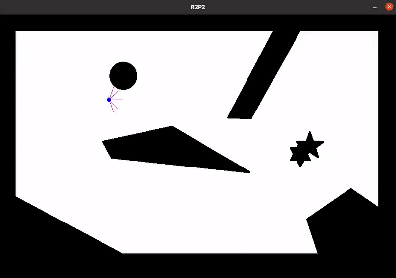
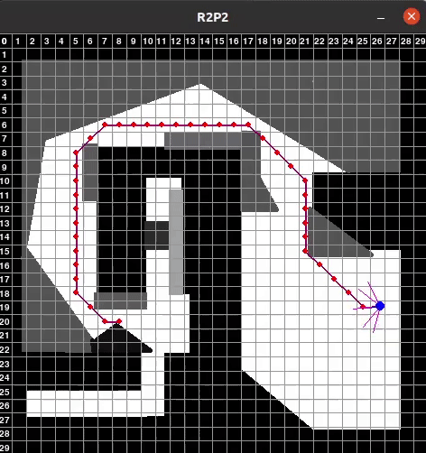
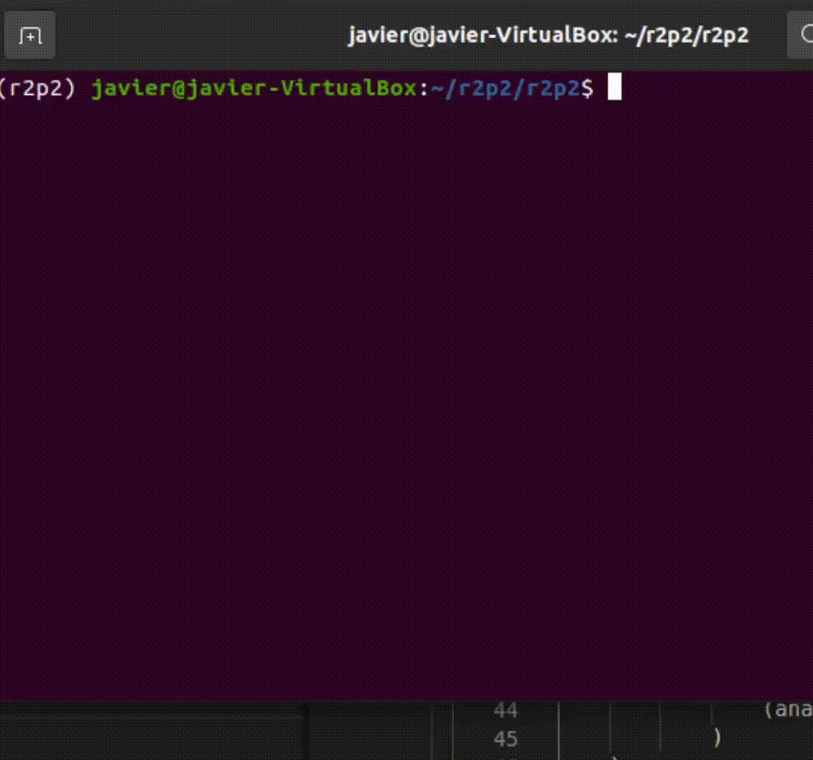

# PECL3 - Planificación automática

Práctica de integración de algoritmos de planificación de ruta con planes de PDDL basada en el repositorio *https://github.com/ISG-UAH/r2p2.git*.

## Entorno

El repositorio ha sido utilizado con:
- Ubuntu 20.04 LTS
- Python 3.7 *(en entorno Conda)*

## Algoritmos de planificación de rutas

Se ha comenzando probando el repositorio controlando el robot de forma manual.

```bash
  cd r2p2/ ; python r2p2.py  
```

<p align="center">
  
</p>

El siguiente paso ha sido correr el scenario por defecto que sería `test_2` con el algoritmo A* y la heurística naive.

```bash
  cd r2p2/ ; python r2p2.py  --scenario ../conf/scenario-pathplanning.json
```

<p align="center">
  
</p>

Como se vió se tienen implementados los planificadores A* y Dikjstra, por otra parte unicamente se tiene la heurística naive.
Se implementa en el fichero `r2p2/thetaStar.py` el algoritmo Theta* a partir del A* y en el fichero `r2p2/heuristics.py` donde se han implementado las heurísticas de la distancia euclídea, manhattan y octile.

Tras esto se crea un scenario semejante al de la diapositiva 38 de [los apuntes](https://github.com/Malola2015/planningCourse/blob/master/robotics/pathplanning.pdf).

[Comparativa entre los diferentes algoritmos y heurísticas](https://github.com/Javier-DlaP/r2p2/comparative.md)

## Integración con PDDL

El modelo y el problema en el que se ha basado ha sido uno de los creados en la PECL2 de la asignatura, este ha sido guardado dentro del repositorio en `Planetary_exploration_on_Mars/`.
Se ha modificado tanto el modelo como el problema para que se ajuste más con la integración del planificador de rutas.
Para probar esta integración se puede ejecutar el archivo `r2p2/pddl_r2p2.sh`.

```bash
  cd r2p2/ ; ./pddl_r2p2.sh
```

<p align="center">
  
</p>

## Trabajos futuros

Tras la integración con PDDL se ha llegado a solucionar un problema de un rover, mostrarlo y calcular la rutas con un planificador de rutas.
Pero esto no sería todo para que fuera utilizable en un robot real, serían necesarias multiples mejoras:

- Calculo de la aproximación de la distancia de un punto a otro de forma automática
- Calculo de la incertidumbre de los sensores y trabajo con esta (odometría y cámaras tienen errores)
- Mantenimiento del estado interno del robot de una acción a otra
- Diferenciar entre planificación global y local
- Implementación de técnicas de obtención de rejillas de forma automática
- Cálculo del tiempo de ejecución al ser una aplicación en tiempo real (y ajustarse a la potencia de computo que se tiene)

Como se ve, no se ha hecho más que rozar lo que sería un sistema de control para robots, además hay que decidir una arquitectura como se explica en el tema de [Autonomoud Control architures](https://github.com/Malola2015/planningCourse/blob/master/robotics/controlarchitectures.pdf) por lo que habría mucho trabajo por delante si se quisiera llevar a escenarios reales.