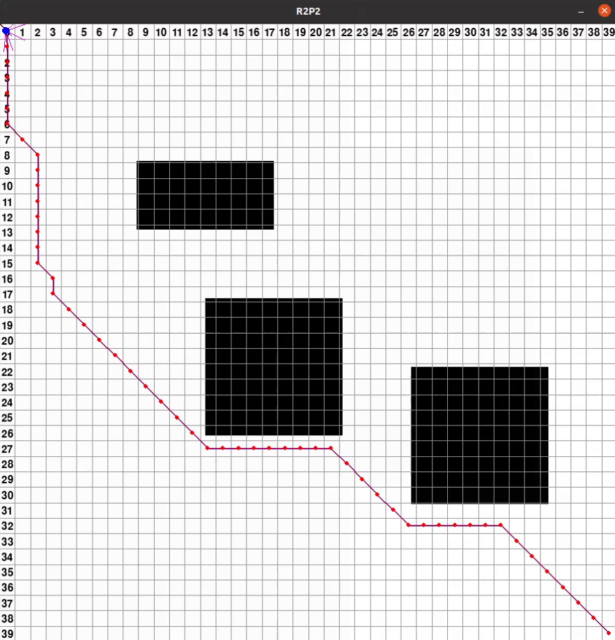
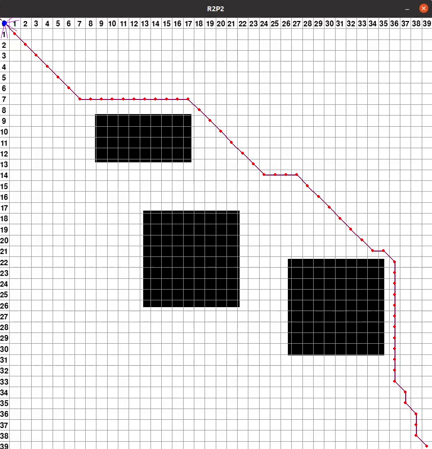
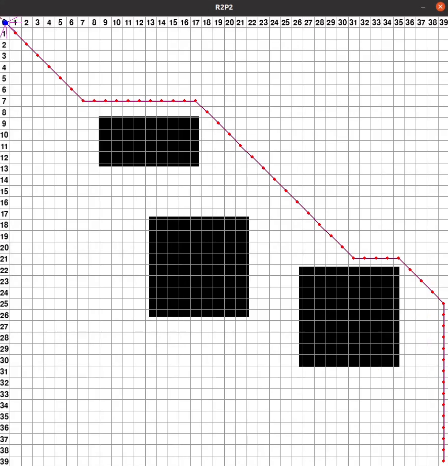
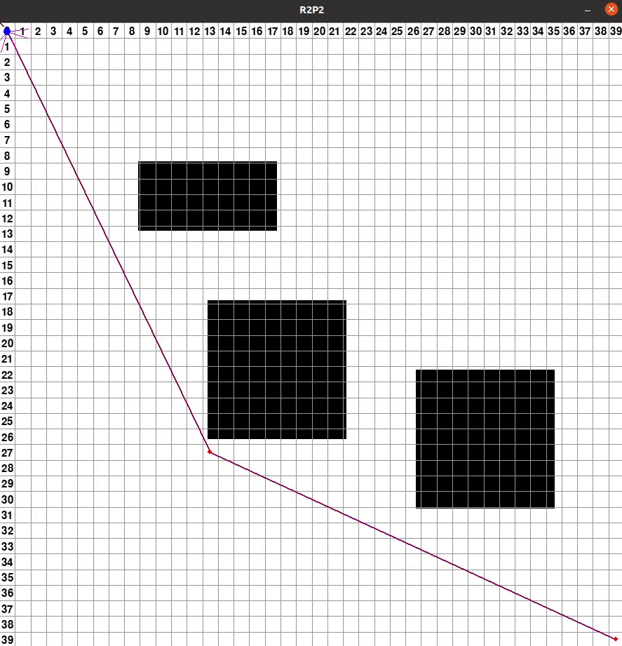
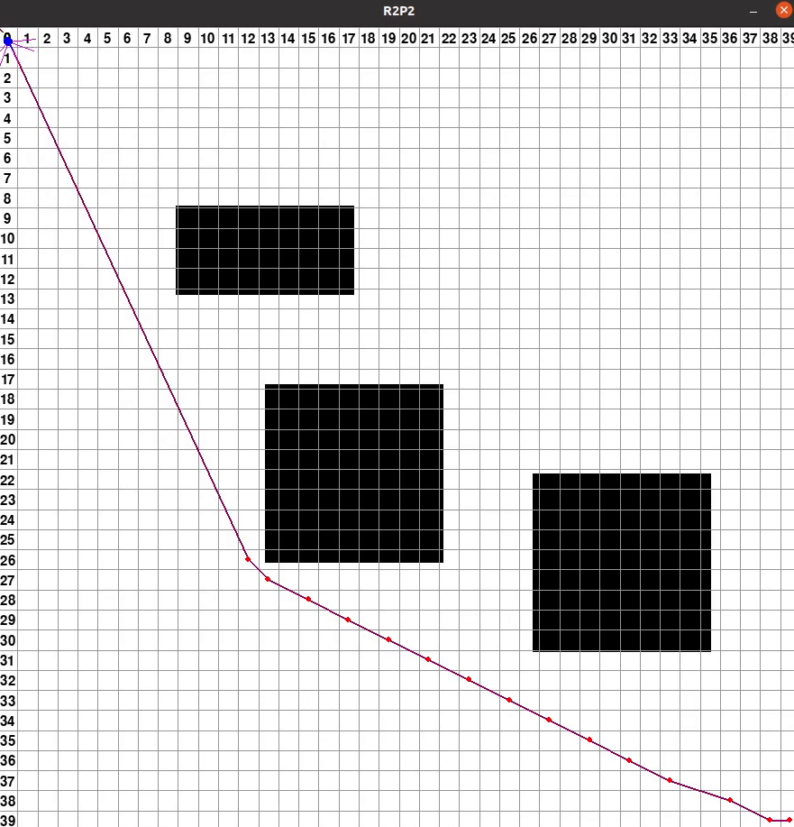
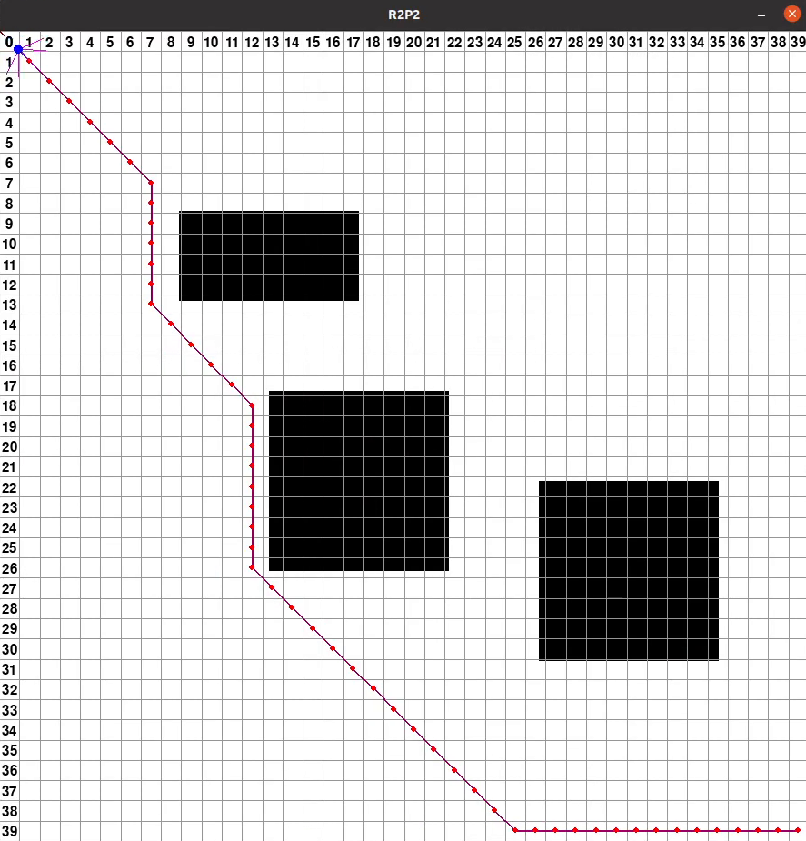
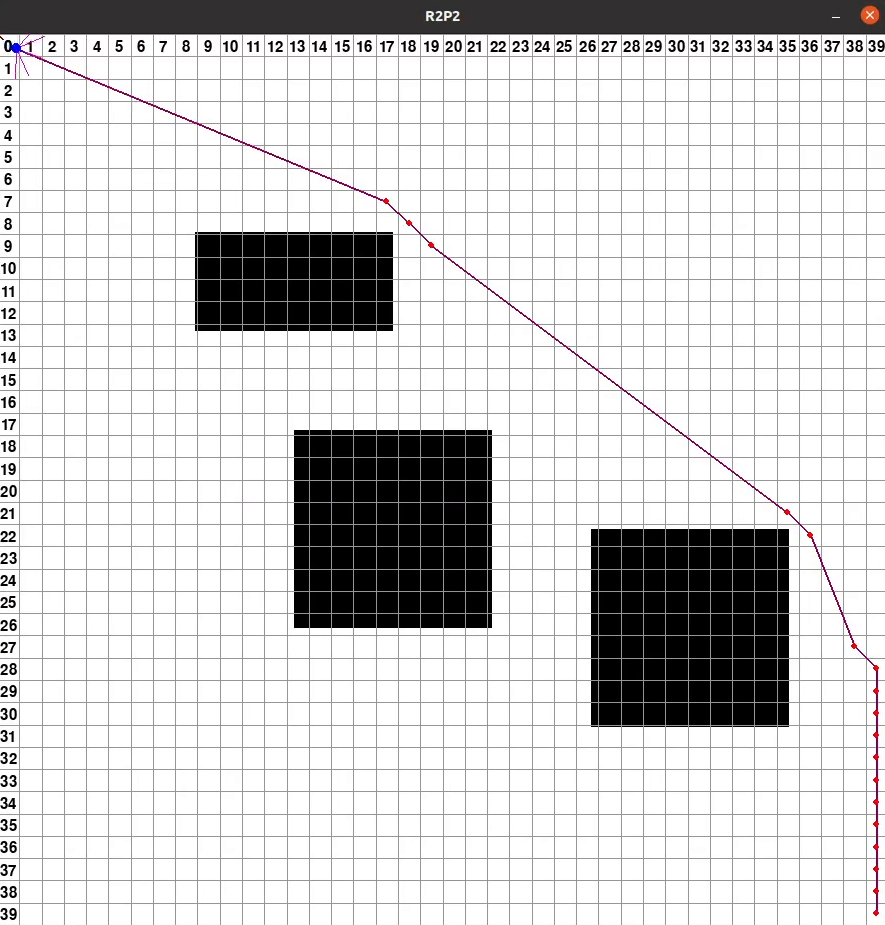

# Comparativa entre los diferentes algoritmos y heurísticas

#### A* y naive

  

#### A* y euclídea

  

#### A* y manhattan

  

#### A* y octile

  

#### Dijkstra

  

#### Theta* y naive

  

#### Theta* y euclídea

  

#### Theta* y manhattan

  

#### Theta* y octile

  

